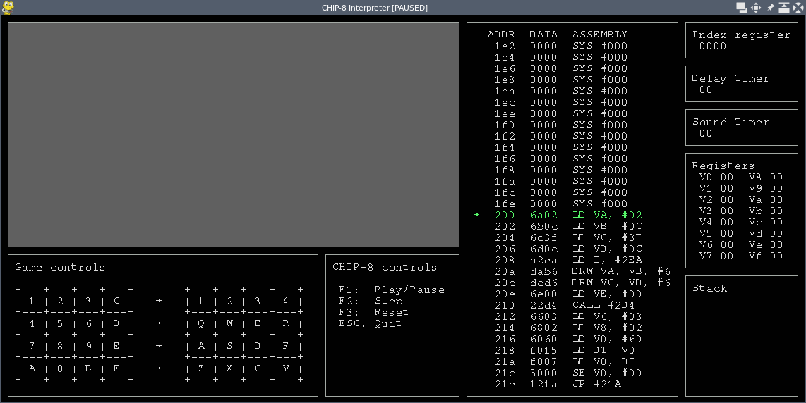

# CHIP-8 Interpreter

## 1. Description

This is my own [CHIP-8](https://en.wikipedia.org/wiki/CHIP-8) interpreter, with a debugger showing memory contents as [assembly code](http://devernay.free.fr/hacks/chip8/C8TECH10.HTM#3.1), registers, stack and timers.



## 2. Install

You'll need pipenv:

```bash
pipenv install --ignore-pipfile
```

## 3. Test ROMs

### 3.1. IBM logo test

```bash
./run.sh test-roms/1-ibm-logo.ch8
```

It should draw the IBM logo in a few instructions and then freeze in an endless jump. Only needs 6 instructions to work, so this is the first test I executed when I was developing the interpreter.


### 3.2. BC test

```bash
./run.sh test-roms/2-bc-test.ch8
```

If there is a failing test an error code will be drawn in the display:

- `E 01`: `3XNN`, verify that the jump condition is fair.
- `E 02`: `5XY0`, verify that the jump condition is fair.
- `E 03`: `4XNN`, verify that the jump condition is fair.
- `E 04`: `7XNN`, check the result of the addition.
- `E 05`: `8XY5`, verify that `VF` is set to `0` when there is a borrow.
- `E 06`: `8XY5`, verify that `VF` is set to `1` when there is no borrow.
- `E 07`: `8XY7`, verify that `VF` is set to `0` when there is a borrow.
- `E 08`: `8XY7`, verify that `VF` is set to `1` when there is no borrow.
- `E 09`: `8XY1`, check the result of the `OR` operation.
- `E 10`: `8XY2`, check the result of `AND` operation.
- `E 11`: `8XY3`, check the result of the `XOR` operation.
- `E 12`: `8XYE`, verify that `VF` is set to the `MSB` before the shift and `VF` does not take value `0` every time.
- `E 13`: `8XYE`, verify that `VF` is set to the `MSB` before the shift and `VF` does not take value `1` every time.
- `E 14`: `8XY6`, verify that `VF` is set to the `LSB` before the shift and `VF` does not take value `0` every time.
- `E 15`: `8XY6`, verify that `VF` is set to the `LSB` before the shift and `VF` does not take value `1` every time.
- `E 16`: `FX55` and `FX65`, verify that these two opcodes are implemented. The error may come from one or the other or both are defects.
- `E 17`: `FX33`, calculating the binary representation is mistaken or the result is poorly stored into memory or poorly poped (`FX65` or `FX1E`).

More info at <https://github.com/daniel5151/AC8E/blob/master/roms/bc_test.txt>.

### 3.3. Opcode test

```bash
./run.sh test-roms/3-test-opcode.ch8
```

It should pass every test with "OK".

More info at <https://github.com/corax89/chip8-test-rom>.

## 4. Run a game

```bash
./run.sh games/pong.ch8
```

## 5. More info

- CHIP-8 references:
  - Wikipedia: <https://en.wikipedia.org/wiki/CHIP-8>
  - Cowgod's tech reference: <http://devernay.free.fr/hacks/chip8/C8TECH10.HTM>
- ROMs:
  - CHIP-8 Archive: <https://johnearnest.github.io/chip8Archive/?sort=platform>
  - CHIP-8 Website (Web Archive): <https://web.archive.org/web/20130903155600/http://chip8.com/?page=109>
- Guide on CHIP-8 development: <https://tobiasvl.github.io/blog/write-a-chip-8-emulator/>

## 6. Future improvements

- Improve keyboard controls.
- Try to reduce display flickering.
- Highlight pressed keys.
- Highlight recently changed register, timer, memory address, etc.
- Graphical buttons for play/pause, step and reset.
- Load ROM from UI.
- Prettier UI.
